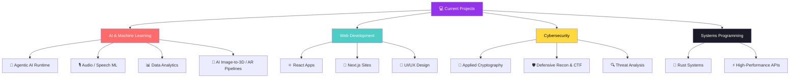
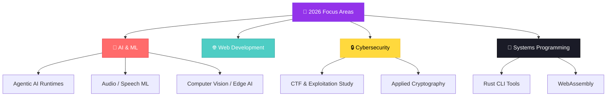

<div align="center">


# 👨‍💻 Krishnang Pandey

**AI/ML STUDENT - Chitkara University , Rajpura** | Python · REACT.js · C++ · FastAPI · ML · Agentic Systems

<a href="https://github.com/krriisshhnnaaa"></a>

[](mailto:official.krishnangpandey@gmail.com)
[]((https://github.com/krriisshhnnaaa))

<br>


</div>

---

<div align="center">

### 🧭 Quick Navigation

[📊 Stats](#-github-stats) · [👋 About](#-about-me) · [🛠️ Tech Stack](#️-tech-stack) · [🗺️ Roadmap](#️-2026-roadmap) · [🎨 Approach](#-unique-approach)

</div>

---

<div align="center">

</div>

## 📊 GitHub Stats

<div align="center">


<br>


<br>


</div>

---

## ⭐ Repository Stars

<div align="center">


</div>

---

<div align="center">

</div>

## 👋 About Me

```typescript
const ali: Developer = {
  name:     "Krishnang Pandey",
  role:     "AI/ML Student , Chitkara University ",
  location: "🌍 Earth  ·  Open to Remote",

  focus: [
    "🧠 Engineering deterministic runtimes around non-deterministic LLMs",
    "🎙️ Audio/Speech AI — ASR, TTS, and full voice pipelines",
    "🥽 AI image-to-3D pipelines for web AR commerce",
    "🦀 Rust for high-performance systems",
    "🔐 Security-first engineering & applied cryptography",
  ],

  stack: {
    languages: ["JavaScript", "Python", "C#", "Go", "PHP"],
    backend:   ["Node.js/Express", "FastAPI"],
    database:  ["PostgreSQL", "MongoDB", "MySQL", "SQLite"],
    ai_ml:     ["PyTorch", "TensorFlow", "OpenCV", "YOLOv8", "Hugging Face", "Whisper/Wav2Vec2"],
    devOps:    ["Docker", "GitHub Actions", "Linux"],
  },

  learning:  ["Rust Systems Programming", "Distributed Agentic Systems", "Web3"],
  principle: "Simple · Tested · Secure · Always improving",
};
```

---

<div align="center">

</div>


## 🛠️ Tech Stack

<div align="center">

<a href="https://skillicons.dev">
  
</a>

<br><br>

**Languages**


**Frontend & Full Stack**


**Backend & APIs**


**Databases & Infrastructure**


**AI / ML**


**Automation & Cloud**


</div> 


### 💡 What I'm Building



---

<div align="center">

## 🌟 Skills & Interests

</div>

<table>
  <tr>
    <td width="33%" valign="top">
      <h3>🎯 Currently Focused On</h3>
      - 🔭 Building <strong>agentic AI runtimes</strong><br>
      - 🎙️ Deepening <strong>Audio/Speech ML</strong><br>
      - 🌱 Mastering <strong>Advanced ML & Deep Learning</strong><br>
      - 👯 Open to <strong>Open Source contributions</strong><br>
      - 🤝 Seeking <strong>collaboration opportunities</strong><br>
      - 🚀 Exploring <strong>Cloud Architecture & DevOps</strong><br>
      - 🔐 Learning <strong>Advanced Cybersecurity</strong>
    </td>
    <td width="33%" valign="top">
      <h3>🎨 Beyond Tech</h3>
      - 🌍 <strong>Geography</strong> - Exploring world cultures<br>
      - 🧬 <strong>Biology</strong> - Understanding life sciences<br>
      - ⚗️ <strong>Chemistry</strong> - Molecular interactions<br>
      - ⚽ <strong>Football</strong> - Strategy & analytics<br>
      - 📺 <strong>TV Series</strong> - Storytelling art<br>
      - 💊 <strong>Pharmacy</strong> - Medical innovations<br>
      - 🧠 <strong>Neuroscience</strong> - Brain functions
    </td>
    <td width="33%" valign="top">
      <h3>🎓 Always Learning</h3>
      - 📚 Reading technical books<br>
      - 🎯 Taking online courses<br>
      - 🏗️ Building side projects<br>
      - 🤝 Contributing to open source<br>
      - 📝 Writing technical blogs<br>
      - 🎤 Sharing knowledge<br>
      - 🌱 Growing every day
    </td>
  </tr>
</table>

<div align="center">
  <em>*These diverse interests fuel my creativity and bring unique perspectives to problem-solving!*</em>
</div>

---

<div align="center">

</div>

## 🗺️ 2026 Roadmap



---

<div align="center">

</div>

## 🎨 Unique Approach

My interdisciplinary background directly shapes how I design systems:

| Domain | Applied to |
|---|---|
| 🧬 **Biology** | Biomimetic algorithms & evolutionary optimization |
| ⚗️ **Chemistry** | Reaction-rate modeling for distributed systems & backpressure |
| 🧠 **Neuroscience** | Brain-inspired neural architectures & attention mechanisms |
| 📊 **Sports Analytics** | Data-driven decision frameworks & probabilistic modeling |

---

<div align="center">


<br>

### 🌟 *"A developer's job isn't limited to write code anymore, it is to solve existing problems while minimizing potential future problems"*

<br>

### 🤝 Let's Build Something Together

[](mailto:official.krishnangpandey@gmail.com)
[](https://github.com/krriisshhnnaaa)

<br>


**⭐️ From [KRISHNA](https://github.com/krriisshhnnaaa) — Made with 💜 in Markdown**


</div>
