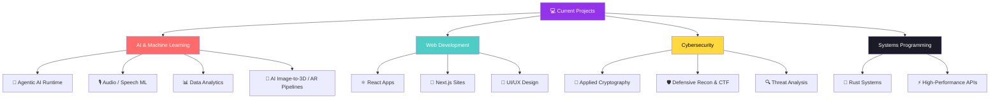
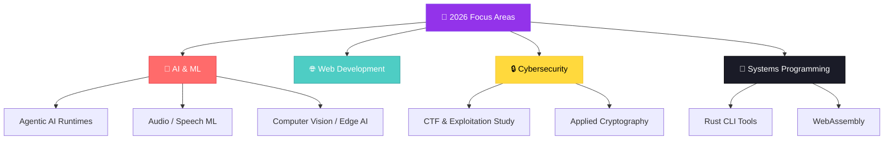

<div align="center">


# 👨‍💻 Krishnang Pandey

**AI/ML STUDENT - Chitkara University , Rajpura** | Python · REACT.js · C++ · FastAPI · ML · Agentic Systems

<a href="https://github.com/krriisshhnnaaa">
  
</a>

[](mailto:official.krishnangpandey@gmail.com)
[]((https://github.com/krriisshhnnaaa))

<br>

([


</div>

---

<div align="center">

### 🧭 Quick Navigation

[📊 Stats](#-github-stats) · [👋 About](#-about-me) · [🛠️ Tech Stack](#️-tech-stack) · [🚀 Projects](#-featured-projects) · [🎓 Deep-Dive Labs](#-deep-dive-technical-labs) · [🛡️ Security & CTF](#-security-research--ctf) · [📖 Learning Library](#-learning-resources--inspiration) · [🗺️ Roadmap](#️-2026-roadmap) · [🎨 Approach](#-unique-approach)

</div>

---

<div align="center">

</div>

## 📊 GitHub Stats

<div align="center">


<br>


<br>


</div>

---

## ⭐ Repository Stars

<div align="center">


</div>

---

<div align="center">

</div>

## 👋 About Me

```typescript
const ali: Developer = {
  name:     "Ali Heydari",
  role:     "Full-Stack Software Engineer & AI Systems Builder",
  location: "🌍 Earth  ·  Open to Remote",

  focus: [
    "🧠 Engineering deterministic runtimes around non-deterministic LLMs",
    "🎙️ Audio/Speech AI — ASR, TTS, and full voice pipelines",
    "🥽 AI image-to-3D pipelines for web AR commerce",
    "🦀 Rust for high-performance systems",
    "🔐 Security-first engineering & applied cryptography",
  ],

  stack: {
    languages: ["JavaScript", "Python", "C#", "Go", "Rust", "PHP"],
    backend:   ["Node.js/Express", "FastAPI", "Blazor", ".NET MAUI"],
    database:  ["PostgreSQL", "MongoDB", "MySQL", "SQLite", "Prisma"],
    ai_ml:     ["PyTorch", "TensorFlow", "OpenCV", "YOLOv8", "Hugging Face", "Whisper/Wav2Vec2"],
    devOps:    ["Docker", "GitHub Actions", "Linux"],
    security:  ["OWASP", "Applied Cryptography", "Network Security", "Recon Tooling"],
  },

  learning:  ["Rust Systems Programming", "Distributed Agentic Systems", "Web3"],
  principle: "Simple · Tested · Secure · Always improving",
};
```

<div align="center">

```bash
npx ali-hey-0  # Coming soon: CLI tool to showcase my work!
```

</div>

---

<div align="center">

</div>

## 🛠️ Tech Stack

<div align="center">

<a href="https://skillicons.dev">
  
</a>

<br><br>

**Languages**


**Frameworks & Backend**


**Databases & DevOps**


**AI / ML**


</div>

---

<div align="center">

</div>

## 🚀 Featured Projects

<!-- ─────────────────────────────────────────────────────────────────
     HOW TO ADD A PROJECT:
     Copy any row from the relevant table below, fill in:
       - Name (bold, with emoji)
       - One-line description
       - Tech badges  →  
       - Live Demo    →  [Visit](URL)  or  —
       - Source Code  →  [Repo](URL)  or  🔒 Private
     Keep one row per project. Column order must match the header.
───────────────────────────────────────────────────────────────── -->

### ⭐ Flagship: AI-Powered AR Commerce Pipeline

**ARCore** — *Photo-to-AR, in one pipeline.*

An end-to-end system that turns product photos (or a short video) into scale-accurate, AR-ready 3D assets — a customer scans a QR code and sees the *actual-size* piece of furniture in their own room, no app install required.

- 🎯 **Multi-provider 3D generation with automatic failover** — Tripo3D → Meshy → Hugging Face → local fallback, with every fallback transparently flagged in the output manifest rather than silently faked
- 📐 **Metric-accurate scale calibration** — operator-supplied dimensions are baked directly into the glTF scene graph with automated QA (±5% tolerance), so a 220 cm sofa renders as an actual 220 cm sofa
- 🎨 **Live material & color customization**, re-baked into a fresh GLB/USDZ before every AR hand-off
- 📱 **Cross-platform AR delivery** — WebXR/Scene Viewer on Android, Quick Look/USDZ on iOS, 360° fallback on incompatible devices
- ⚙️ **Async job pipeline** — FastAPI background jobs with poll-based status, so uploads never block on slow upstream AI providers

    

**Engineering rigor:** 150+ backend tests and 50+ frontend tests passing in CI, strict TypeScript compilation, containerized deployment.

> 🔒 Private client engagement — repository not public.

### 🌐 Web & Full-Stack

| Project | Description | Tech | Live Demo | Source |
|---|---|---|---|---|
| 📝 **Personal Blog** | Technical journey, project write-ups, and ideas. |  | [Visit](https://abedini.me/fa/) | [Repo](https://github.com/Ali-hey-0/blog) |
| 🏭 **Arka Industrial** | Industrial e-commerce platform — staging, moving to production soon. |  | [Staging](https://arka-industrial.com) | [Repo](https://github.com/Ali-hey-0/arka-industrial) |
| 🌌 **Simulation** | Interactive 3D visualization of the universe across 65 orders of magnitude — quantum (10⁻³⁵) to cosmic (10⁺³⁰) — with real-time physics. |  | [Visit](https://github.com/Ali-hey-0/Simulation) | [Repo](https://github.com/Ali-hey-0/Simulation) |
| 🏫 **EduPortal** | School management website with PHP and MySQL. |   | — | [Repo](https://github.com/Ali-hey-0/EduPortal) |

### 🖥️ Desktop & Mobile (.NET)

| Project | Description | Tech | Live Demo | Source |
|---|---|---|---|---|
| 💼 **AdvanceAccounting** | Windows desktop accounting application for business bookkeeping and finances. |  | — | [Repo](https://github.com/Ali-hey-0/AdvanceAccounting) |
| ⚖️ **BLE Weight Terminal** | .NET MAUI app — connects to an HC-08/HM-10 BLE sensor and streams live weight readings with auto-reconnect and CSV logging. |  | — | [Repo](https://github.com/Ali-hey-0/BLE-Weight-Terminal) |

### 🤖 AI / ML & Edge AI

| Project | Description | Tech | Live Demo | Source |
|---|---|---|---|---|
| ♻️ **Yolo8n Edge Benchmark** | YOLOv8n evaluation framework for waste-sorting on a Rockchip NPU — covers latency, model size, thermal robustness, and per-class metrics. Ships `.pt` + `.onnx` + `.npu` |  | — | [Repo](https://github.com/Ali-hey-0/Yolo8n_AI_doc) |
| 🌦️ **forecast-fusion** | Multivariate weather forecasting with Transformers + FastAPI — real-time predictions and interactive visualization. |   | [Visit](https://forecast-fusion.vercel.app) | [Repo](https://github.com/Ali-hey-0/forecast-fusion) |
| 🩻 **Chest X-Ray Classifier** | Deep learning web app classifying chest X-rays (COVID-19 / Normal / Pneumonia) with Grad-CAM visualization. |  | [Visit](https://chest-xray-classifier.vercel.app) | [Repo](https://github.com/Ali-hey-0/chest-xray-classifier) |

### 🖥️ Developer Tooling (Codex)

| Project | Description | Tech | Live Demo | Source |
|---|---|---|---|---|
| 🔬 **Aion** | Research platform investigating multi-profile isolation for OpenAI Codex Desktop — Tauri + Rust + React app with an extensive, honestly-documented reverse-engineering log. |   | — | [Repo](https://github.com/Ali-hey-0/Aion) |
| ⚡ **Codex-Account-Selector** | Zero-dependency Windows batch file that launches multiple fully-isolated Codex instances side by side. |  | — | [Repo](https://github.com/Ali-hey-0/Codex-Account-Selector) |

### 🔧 Tools & Utilities

| Project | Description | Tech | Live Demo | Source |
|---|---|---|---|---|
| 📡 **RSS Aggregator** | Full REST API for aggregating RSS feeds — register sources, follow, consume posts. Go + PostgreSQL + Docker. |   | — | [Repo](https://github.com/Ali-hey-0/RSS-Aggregator) |
| 🔍 **BarcodeScannerAPI** | Node.js barcode scanning service — robust processing and easy integration for any app needing barcode recognition. |  | — | [Repo](https://github.com/Ali-hey-0/BarcodeScannerAPI) |
| 🔐 **CryptoVault Pro** | File encryption/decryption shipped as both a Python GUI app and a low-level x86-64 Assembly implementation. |   | — | [Repo](https://github.com/Ali-hey-0/CryptoVault-Pro) |
| 🔲 **QRception** | Fast QR code generator in C. |  | — | [Repo](https://github.com/Ali-hey-0/QRception) |
| 🌐 **WebPulse** | Real-time web performance monitoring and analytics dashboard. |  | [Visit](https://webpulse-monitor.vercel.app) | [Repo](https://github.com/Ali-hey-0/WebPulse) |
| 🔑 **Cryptography Organization** | Centralized reference implementation for symmetric/asymmetric crypto, hashing, digital signatures, and key derivation — with security-best-practices docs. |  | — | [Repo](https://github.com/Ali-hey-0/Cryptography-organization) |

<div align="center">

<a href="https://github.com/Ali-hey-0/Simulation">
  
</a>
<a href="https://github.com/Ali-hey-0/ai-runtime-lab">
  
</a>
<a href="https://github.com/Ali-hey-0/audio-ai-field-guide">
  
</a>
<a href="https://github.com/Ali-hey-0/forecast-fusion">
  
</a>

</div>

---

<div align="center">

</div>

## 🎓 Deep-Dive Technical Labs

> Two long-form, systems-thinking reference repositories — each is a structured curriculum with runnable code, not a tutorial transcript. Built to teach transferable mental models rather than framework-specific tricks.

<table>
<tr>
<td width="50%" valign="top">

### 🧠 [AI Runtime Lab](https://github.com/Ali-hey-0/ai-runtime-lab)

**Engineering deterministic systems around non-deterministic models.**

A 14-phase (of 17) systems-engineering curriculum answering one question: *how do you build reliable, auditable, production-grade software on top of a component that is fundamentally probabilistic?*

**Covers:** FSM & state control · durable execution & crash recovery · retry/idempotency · DAG-based parallel workflows · agent runtimes · model routing · edge inference & quantization · RAG · memory systems · multi-agent orchestration · prompt-injection defense & sandboxing · full-system observability.


**[→ Explore the repo](https://github.com/Ali-hey-0/ai-runtime-lab)**

</td>
<td width="50%" valign="top">

### 🎙️ [Audio AI Field Guide](https://github.com/Ali-hey-0/audio-ai-field-guide)

**From raw waveform to production voice systems.**

A complete, mental-model-first reference spanning the entire audio ML stack: datasets → preprocessing → Transformer architectures → ASR → audio classification → TTS → full voice-system pipelines (voice assistants, meeting transcription, speech-to-speech translation).

**Covers:** CTC vs. Seq2Seq architectures · Whisper/Wav2Vec2 internals · fine-tuning ASR & TTS · Speaker Diarization & VAD · evaluation metrics (WER, MOS) · a 30+ term glossary.


**[→ Explore the repo](https://github.com/Ali-hey-0/audio-ai-field-guide)**

</td>
</tr>
</table>

### 💡 What I'm Building



---

<div align="center">

## 🌟 Skills & Interests

</div>

<table>
  <tr>
    <td width="33%" valign="top">
      <h3>🎯 Currently Focused On</h3>
      - 🔭 Building <strong>agentic AI runtimes</strong><br>
      - 🎙️ Deepening <strong>Audio/Speech ML</strong><br>
      - 🌱 Mastering <strong>Advanced ML & Deep Learning</strong><br>
      - 👯 Open to <strong>Open Source contributions</strong><br>
      - 🤝 Seeking <strong>collaboration opportunities</strong><br>
      - 🚀 Exploring <strong>Cloud Architecture & DevOps</strong><br>
      - 🔐 Learning <strong>Advanced Cybersecurity</strong>
    </td>
    <td width="33%" valign="top">
      <h3>🎨 Beyond Tech</h3>
      - 🌍 <strong>Geography</strong> - Exploring world cultures<br>
      - 🧬 <strong>Biology</strong> - Understanding life sciences<br>
      - ⚗️ <strong>Chemistry</strong> - Molecular interactions<br>
      - ⚽ <strong>Football</strong> - Strategy & analytics<br>
      - 📺 <strong>TV Series</strong> - Storytelling art<br>
      - 💊 <strong>Pharmacy</strong> - Medical innovations<br>
      - 🧠 <strong>Neuroscience</strong> - Brain functions
    </td>
    <td width="33%" valign="top">
      <h3>🎓 Always Learning</h3>
      - 📚 Reading technical books<br>
      - 🎯 Taking online courses<br>
      - 🏗️ Building side projects<br>
      - 🤝 Contributing to open source<br>
      - 📝 Writing technical blogs<br>
      - 🎤 Sharing knowledge<br>
      - 🌱 Growing every day
    </td>
  </tr>
</table>

<div align="center">
  <em>*These diverse interests fuel my creativity and bring unique perspectives to problem-solving!*</em>
</div>

---

<details>
<summary><h2 style="display:inline;">🛡️ Security Research & CTF</h2></summary>

> Defensive-security and CTF-style learning — training labs, wargame walkthroughs, reconnaissance tooling, and a structured exploitation-curriculum roadmap. No attack tooling, no unauthorized-access content.

| Project | Description | Link |
|---|---|---|
| 🛡️ **owasp** | OWASP-based security training & penetration-testing lab. | [Repo](https://github.com/Ali-hey-0/owasp) |
| 💣 **nightmare-exploit-roadmap** | Structured binary-exploitation curriculum: stack, heap, mitigations, ROP, automated exploitation. | [Repo](https://github.com/Ali-hey-0/nightmare-exploit-roadmap) |
| 🔑 **NatasPasswordCracker** | Walkthrough/solver for the Natas web-security wargame (OverTheWire). | [Repo](https://github.com/Ali-hey-0/NatasPasswordCracker) |
| 🧩 **recon-modular** | Modular reconnaissance framework for authorized security assessments — educational use only. | [Repo](https://github.com/Ali-hey-0/recon-modular) |

</details>

<details>
<summary><h2 style="display:inline;">📖 Learning Resources & Inspiration</h2></summary>

> Repositories imported from other authors to study, reference, or build on — not original work, kept here as a personal library.

| Resource | Original Author | What it's for | Link |
|---|---|---|---|
| LLMs-from-scratch | [rasbt](https://github.com/rasbt) | Implementing a ChatGPT-like LLM in PyTorch from scratch. | [Repo](https://github.com/Ali-hey-0/LLMs-from-scratch) |
| 🤗 datasets | [huggingface](https://github.com/huggingface) | Hub of ready-to-use datasets for AI models. | [Repo](https://github.com/Ali-hey-0/datasets) |
| TensorTrade | [tensortrade-org](https://github.com/tensortrade-org) | RL framework for training algorithmic trading agents. | [Repo](https://github.com/Ali-hey-0/TensorTrade-with-Reinforcement-Learn) |
| heroui | [heroui-inc](https://github.com/heroui-inc) | Modern React UI library (formerly NextUI). | [Repo](https://github.com/Ali-hey-0/heroui) |
| awesome-llm-apps | [Shubhamsaboo](https://github.com/Shubhamsaboo) | Collection of LLM apps with AI Agents and RAG. | [Repo](https://github.com/Ali-hey-0/awesome-llm-apps) |
| Awesome-Hacking | [Hack-with-Github](https://github.com/Hack-with-Github) | Curated lists for hackers, pentesters & security researchers. | [Repo](https://github.com/Ali-hey-0/Awesome-Hacking) |
| awesome-courses | [prakhar1989](https://github.com/prakhar1989) | List of awesome university CS courses. | [Repo](https://github.com/Ali-hey-0/awesome-courses) |
| awesome-interview-questions | [DopplerHQ](https://github.com/DopplerHQ) | Curated interview-question lists. | [Repo](https://github.com/Ali-hey-0/awesome-interview-questions) |
| DALI | [NVIDIA](https://github.com/NVIDIA) | GPU-accelerated data-loading library for deep learning. | [Repo](https://github.com/Ali-hey-0/DALI) |
| practical-tutorials | [jderazoa](https://github.com/jderazoa) | Curated list of project-based tutorials. | [Repo](https://github.com/Ali-hey-0/practical-tutorials-project-based-learning) |
| Qiskit | [Qiskit](https://github.com/Qiskit) | Open-source SDK for quantum computing. | [Repo](https://github.com/Ali-hey-0/Qiskit) |
| opencv | [opencv](https://github.com/opencv) | Open Source Computer Vision Library. | [Repo](https://github.com/Ali-hey-0/opencv) |
| Models-Master | [tensorflow](https://github.com/tensorflow) | Models and examples built with TensorFlow. | [Repo](https://github.com/Ali-hey-0/Models-Master) |
| deep-learning-with-pytorch | [mrdbourke](https://github.com/mrdbourke) | "Learn PyTorch for Deep Learning: Zero to Mastery" course materials. | [Repo](https://github.com/Ali-hey-0/deep-learning-with-pytorch) |
| Freqtrade | [freqtrade](https://github.com/freqtrade) | Open-source crypto trading bot. | [Repo](https://github.com/Ali-hey-0/Freqtrade) |
| Bullet-Physics-SDK | [bulletphysics](https://github.com/bulletphysics) | Real-time collision detection & physics simulation SDK. | [Repo](https://github.com/Ali-hey-0/Bullet-Physics-SDK) |
| EvoSynth | [dongdongunique](https://github.com/dongdongunique) | Evolutionary-synthesis reference project. | [Repo](https://github.com/Ali-hey-0/EvoSynth) |

</details>

---

<div align="center">

</div>

## 🗺️ 2026 Roadmap



---

<div align="center">

</div>

## 🎨 Unique Approach

My interdisciplinary background directly shapes how I design systems:

| Domain | Applied to |
|---|---|
| 🧬 **Biology** | Biomimetic algorithms & evolutionary optimization |
| ⚗️ **Chemistry** | Reaction-rate modeling for distributed systems & backpressure |
| 🧠 **Neuroscience** | Brain-inspired neural architectures & attention mechanisms |
| 📊 **Sports Analytics** | Data-driven decision frameworks & probabilistic modeling |

**Shipped so far:**


---

<div align="center">


<br>

### 🌟 *"The best code is written with passion, refined with discipline, and shared with generosity."*

<br>

### 🤝 Let's Build Something Together

[](mailto:aliheydari1381doc@gmail.com)
[](https://github.com/Ali-hey-0)

<br>


**⭐️ From [Ali-hey-0](https://github.com/Ali-hey-0) — Made with 💜 in Markdown**


</div>
